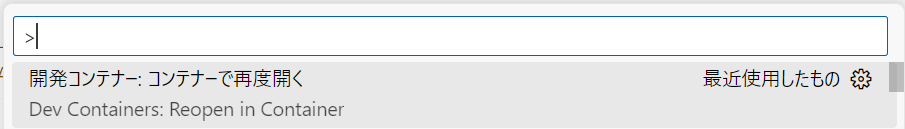

# Javaの開発環境

## 概要

Dev Containerを利用したJavaの開発環境

## 開発環境の構築

### Dev Container を利用する場合

1. 以下のアプリケーションをインストールし、起動する

   ```cmd
   winget install -e --id suse.RancherDesktop
   winget install -e --id Microsoft.VisualStudioCode
   ```

2. Visual Studio Code に以下の拡張機能をインストールする

   [Remote Development](https://marketplace.visualstudio.com/items?itemName=ms-vscode-remote.vscode-remote-extensionpack)

3. Visual Studio Code に本リポジトリを「フォルダを開く」で追加する  
   [ファイル(F)]-[フォルダを開く...]

4. 以下が表示されるので「コンテナーを再度開く」を選択する

   </br>
   もしくは Ctrl+Shift+P で「Dev Containers: ReOpen in Container」を実行する  
   
