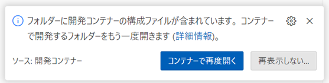
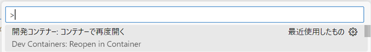
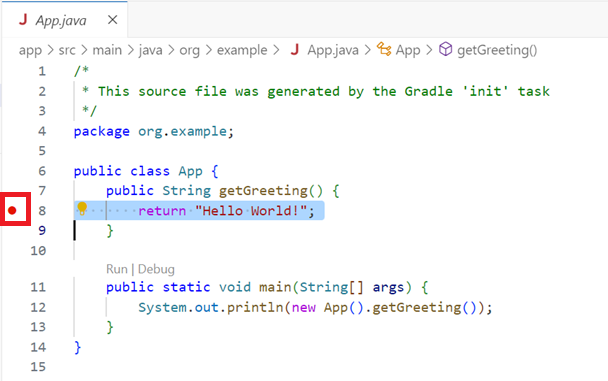
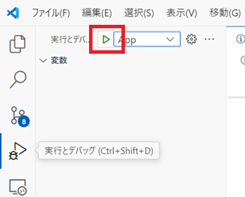
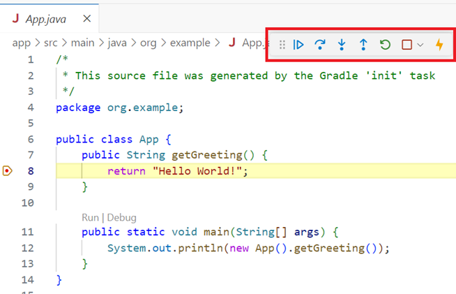

# Java 開発環境

## 概要

Dev Container を利用した Java 開発環境

## 環境構築

1. コマンドプロンプトから以下のコマンドを実行し、アプリケーションをインストールする

   ```batch
   winget install -e --id Microsoft.VisualStudioCode
   winget install -e --id suse.RancherDesktop
   ```

2. RancherDesktop を起動し、初期設定する

3. Visual Studio Code に、以下の拡張機能をインストールする

   [Remote Development](https://marketplace.visualstudio.com/items?itemName=ms-vscode-remote.vscode-remote-extensionpack)

4. Visual Studio Code の「フォルダを開く」で、本リポジトリを開く  
   [ファイル(F)]-[フォルダを開く...]

5. 右下にポップアップが表示されるので「コンテナーを再度開く」を選択する

   

   もしくは Ctrl+Shift+P で「Dev Containers: ReOpen in Container」を実行する  
   

## 開発

### 実行

1. プロジェクトのルートディレクトリで、以下のコマンド実行する

   ```bash {cmd}
   ./gradlew run
   ```

### デバッグ

1. 処理を止めたい行数の左側をクリックし、ブレイクポイントを設定する(赤丸が表示される)

   

2. サイドバーの[実行とデバッグ]を選択し、実行アイコンを押下する

   

3. ブレイクポイントで処理が停止するので、操作パネルで続きの処理を指定する

   

### jar の生成

1. プロジェクトのルートディレクトリで、以下のコマンド実行する

   ```bash {cmd}
   ./gradlew runShadow
   ```

   以下のディレクトリに jar が生成される

   ```
   app/build/libs/app-all.jar
   ```

2. jar の実行

   ```bash {cmd}
   java -jar app/build/libs/app-all.jar
   ```
